# Pulso a Distancia

Este proyecto es una aplicación móvil que permite a los usuarios monitorear datos cardiovasculares propios o de otras personas estos últimos de forma remota, recibiendo alertas en caso de anomalías en las mediciones de los pulsos por minuto del corazón y generando un historial de los diferentes estados para futura referencia. 

La aplicación se integrará con una pulsera con sensores para la medición de datos cardiovasculares. 
La aplicación propone ser una herramienta que facilite a un médico el monitoreo del estado cardiovascular de sus pacientes o el de algún individuo que esté al cuidado de otra persona.

¿Qué tecnología usa?

Software:
* dart versión: 3.3.4-4.0.0
* flutter versión: 3.19.2^
* Android SDK versión: 21^
* Arduino IDE versión: 2.3.2
* Driver 2.0.16 by Espressif Systems (Necesario para trabajar con ESP32)

Hardware:
* ESP-WROOM-32 ESP32 ESP-32S 
* Sensor de pulso fotoeléctrico
  
## ¿Cómo Instalar y Correr el Proyecto?

Necesitas tener instalado el SDK Flutter, para ello te puedes apoyar en el siguiente enlace: [Flutter 🔎](https://docs.flutter.dev/get-started/install)

Para clonar el proyecto abre una terminal en la ubicación deseada y escribe el comando (Debes de tener git instalado para realizar esta acción):

```bash
git clone https://github.com/ZesRamal/pulso_a_distancia.git
```
Para ejecutarla se abre una terminal en la ubicación del proyecto y se escribe el comando:
```bash
flutter run
```
NOTA: Dentro del entorno que estés programando, asegurate de contar con un dispositivo emulado o físico conectado para poder ejecutar la aplicación. 


Para la parte del hardware es necesario una placa de desarrollo ESP-WROOM-32 ESP32 ESP-32S y un sensor de pulso fotoeléctrico donde le cargaremos el [código de arduino](https://github.com/ZesRamal/pulso_a_distancia/blob/sensor/Sensor.ino), para ello puedes descargar el IDE en [Arduino 🔎](https://www.arduino.cc/en/software)

NOTA: Recuerda elegir el sistema operativo en el que estés trabajando.


## ¿Cómo usar el proyecto?

En el móvil, haremos emparejamiento con el módulo de trabajo y en la app nos dirigimos a la sección del perfil del usuario y nos aseguramos de que se establezca conexión a la app, con todo conectado, apoyar el sensor en cualquier parte del cuerpo que cuente con un vaso sanguíneo para empezaran a visualizar los datos del pulso en la pantalla principal de la aplicación.

## Estado y Roadmap

#### Estado:
Activo y en desarrollo.

#### Roadmap:
- Implementar cuentas de usuario.
- Implementar sistema de solicitudes de seguimiento.
- Implementar consulta de rangos de tiempo en historial.
- Aplicar analisis de datos del historial para predicción de anomalías en el pulso.
- Añadir detección de actividad física con giroscopio.

## Pantallas de la Aplicación

- *Pantalla de Estado del Usuario.* Aquí se visualiza el último dato de pulsasiones por minuto medido por el sensor.

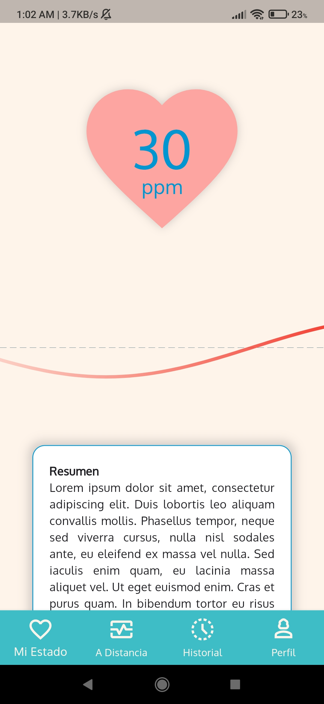

- *Pantalla de Lista de Usuarios Monitoreados.* Aquí se visualiza la lista de usuarios que estamos monitoreando, se puede dar clic al inidividuo para acceder a su información.

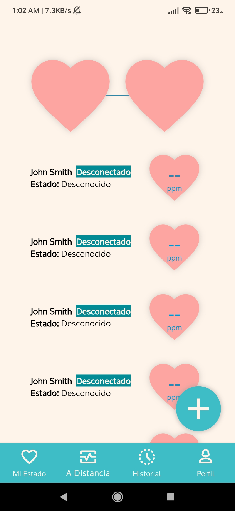

- *Pantalla de Historial de Pulso.* Aquí se visualiza la gráfica que muestra los cambios en los valores de PPM según el tiempo.

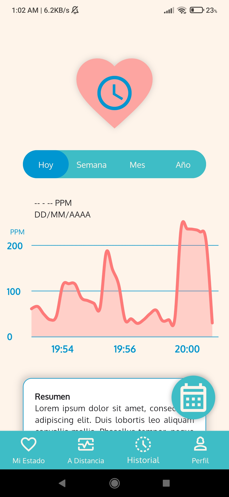

- *Pantalla de Estado del Usuario Remoto.* Aquí se visualiza el último dato de pulsasiones por minuto medido por el sensor que utiliza el usuario a distancia.

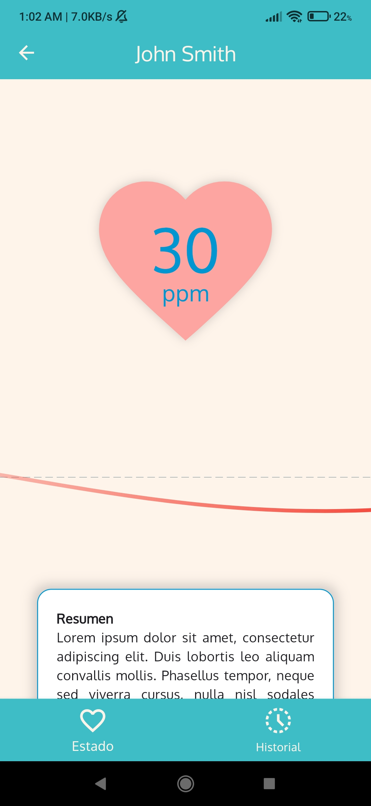

- *Pantalla de Historial de Pulso del Usuario Remoto* Aquí se visualiza la gráfica que muestra los cambios en los valores de PPM según el tiempo del usuario a distancia.

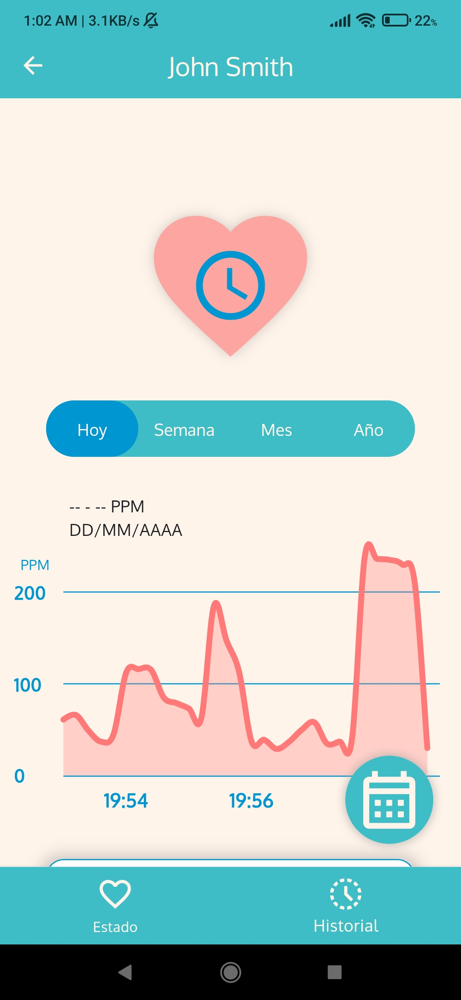

- *Pantalla de Perfil de Usuario.* Aquí se visualiza la información básica del perfil junto con opciones adicionales para el uso de la aplicación.

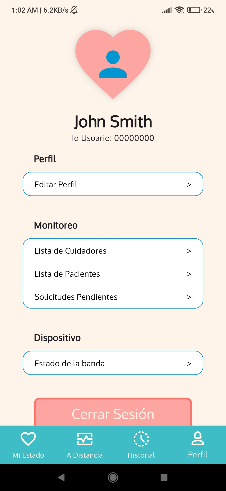

- *Pantalla de Edición de Perfil.* Aquí se visualiza el apartado donde se permitirá en un futuro modificar información de nuestro perfil.

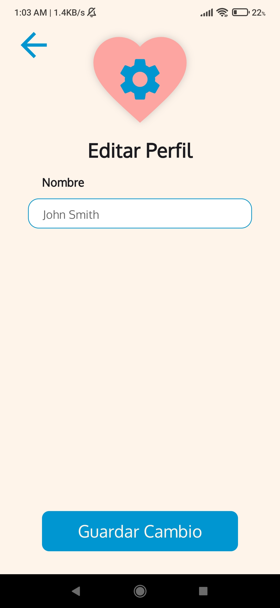

- *Pantalla de Lista de Cuidadores del Perfil* Aquí se visualiza la lista de usuarios que nos están monitoreando, se puede eliminar a alguien desde esta pantalla.

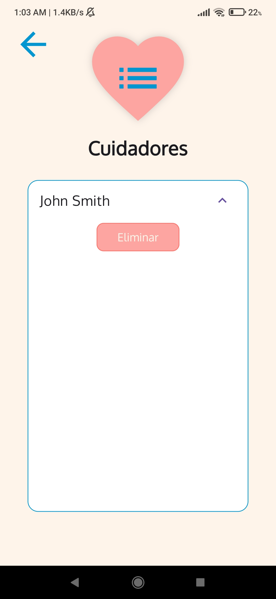

- *Pantalla de Lista de Usuarios Monitoreados del Perfil.* Aquí se visualiza la lista de usuarios que estamos monitoreando, se puede eliminar a alguien desde esta pantalla.

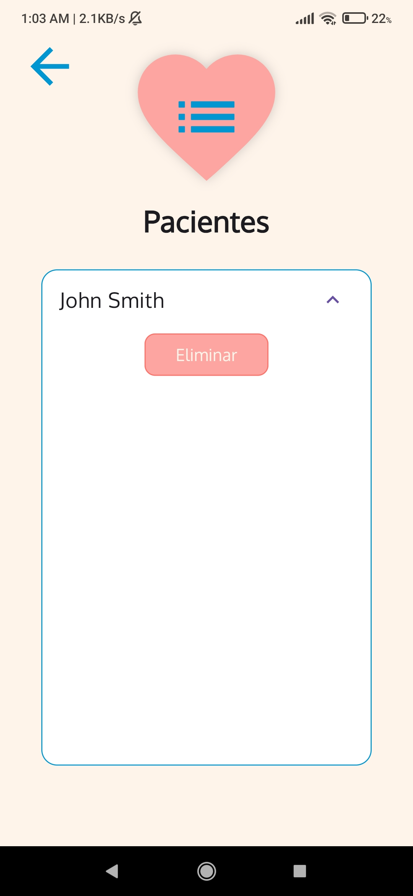

- *Pantalla de Lista de Solitudes de Monitoreo* Aquí se visualiza la lista de solicitudes enviadas o recibidas para monitoreo. Se pueden aceptar, rechazar o cancelar.

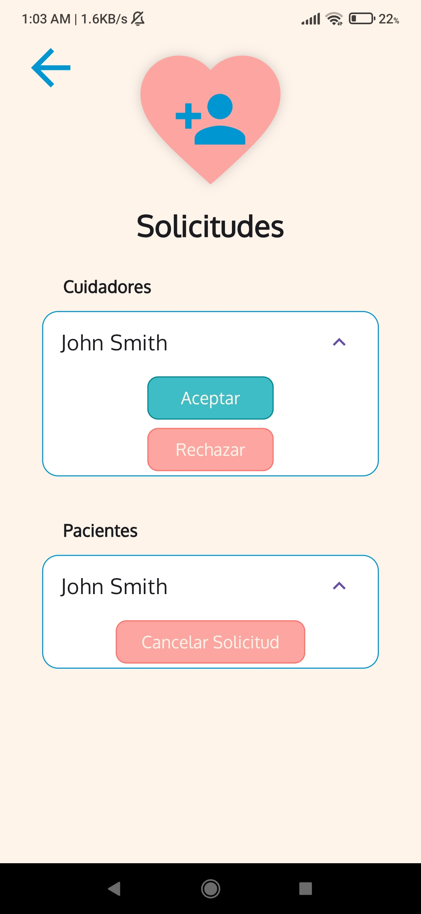

- *Pantalla de Estado de Conexión de la Banda* Aquí se visualiza si existe o no comunicación entre la banda y la aplicación. Se puede desconectar en caso necesario.

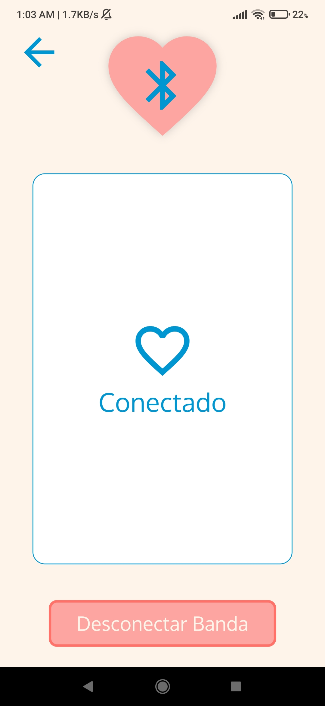

## Créditos

* Project Manager: [Oscar Anguiano Gonzalez](https://github.com/Oscar060502)
* Frontend Dev: [Cesar Francisco Ramos Leal](https://github.com/ZesRamal)
* Backend Dev: [Jared Zaragoza Rosales](https://github.com/K0i0s)
* Database Admin: [Ricardo Escobar Ceseña](https://github.com/XPFLASH)

## Licencias

[Licencia MIT](LICENSE)


